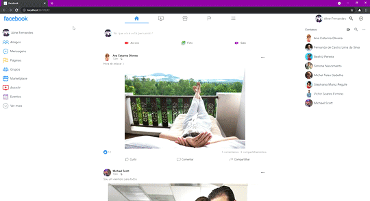

# Facebook - Layout responsivo 

- Projeto desenvolvido como estudo de responsividade em Flutter, acompanhando o curso Flutter 2.0: Crie aplicações responsivas para a Web (Udemy);

- Exibição condicional de Widgets para atender a tamanho de tela adequadamente;

## Versão web:

## Versão mobile:

